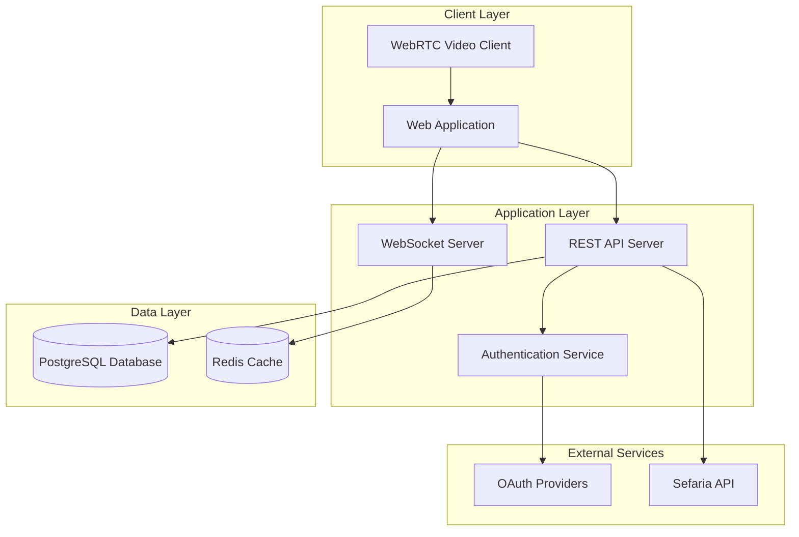

# Design Document

## Overview

The Havruta platform is a real-time collaborative learning application that enables synchronized Jewish text study. The system architecture follows a client-server model with real-time communication capabilities, integrating with external services for authentication (OAuth providers), text content (Sefaria API), and video communication (WebRTC).

The platform consists of a web-based frontend application, a backend API server with real-time capabilities, and a database for user and session management. The design emphasizes real-time synchronization, scalability, and seamless user experience.

## Architecture

### High-Level Architecture



### Technology Stack

**Frontend:**
- React.js with TypeScript for the web application
- WebRTC for peer-to-peer video communication
- Socket.io client for real-time synchronization
- Material-UI or similar for consistent UI components

**Backend:**
- Node.js with Express.js for the REST API
- Socket.io for WebSocket connections and real-time features
- Passport.js for OAuth authentication
- Prisma ORM for database operations

**Database & Caching:**
- PostgreSQL for persistent data storage
- Redis for session management and real-time state caching

**External Integrations:**
- Sefaria API for Jewish text content
- OAuth providers (Google, Apple) for authentication

## Components and Interfaces

### Frontend Components

#### Authentication Component
- **Purpose:** Handle OAuth login flow and session management
- **Key Methods:**
  - `initiateOAuthLogin(provider: string)`
  - `handleAuthCallback()`
  - `logout()`

#### Dashboard Component
- **Purpose:** Display user's Havrutot and provide session management
- **Key Methods:**
  - `fetchUserHavrutot()`
  - `createNewHavruta()`
  - `joinHavruta(sessionId: string)`
  - `scheduleSession()`
  - `inviteParticipants(havrutaId: string, emails: string[])`

#### Participant Invitation Dialog Component
- **Purpose:** Handle email-based participant invitations
- **Key Methods:**
  - `validateEmails(emails: string[])`
  - `sendInvitations(havrutaId: string, emails: string[])`
  - `handleInvitationResponse()`

#### Havruta Session Component
- **Purpose:** Main collaborative study interface
- **Key Methods:**
  - `initializeSession(sessionId: string)`
  - `syncTextNavigation(section: string)`
  - `initializeVideoCall()`
  - `saveProgress()`

#### Text Viewer Component
- **Purpose:** Display and navigate Sefaria texts
- **Key Methods:**
  - `loadText(book: string, section: string)`
  - `navigateToSection(section: string)`
  - `syncWithParticipants()`

### Backend Services

#### Authentication Service
```typescript
interface AuthService {
  authenticateOAuth(provider: string, code: string): Promise<User>
  generateJWT(user: User): string
  validateJWT(token: string): Promise<User>
}
```

#### Havruta Service
```typescript
interface HavrutaService {
  createHavruta(creatorId: string, bookId: string, participants: string[]): Promise<Havruta>
  joinHavruta(userId: string, sessionId: string): Promise<void>
  getHavrutaState(sessionId: string): Promise<HavrutaState>
  updateProgress(sessionId: string, section: string): Promise<void>
  inviteParticipants(havrutaId: string, emails: string[]): Promise<InvitationResult>
}
```

#### Email Service
```typescript
interface EmailService {
  sendHavrutaInvitation(email: string, havrutaDetails: HavrutaInvitation): Promise<void>
  validateEmailFormat(email: string): boolean
  checkExistingUser(email: string): Promise<User | null>
}

interface HavrutaInvitation {
  havrutaId: string
  havrutaName: string
  bookTitle: string
  inviterName: string
  joinLink: string
}

interface InvitationResult {
  successful: string[]
  failed: { email: string; reason: string }[]
  existingUsers: string[]
  newUsers: string[]
}
```

#### Sefaria Integration Service
```typescript
interface SefariaService {
  // Get index of all available texts
  getIndex(): Promise<SefariaIndex[]>
  
  // Get specific text content by reference (e.g., "Genesis 1:1-3")
  getText(ref: string): Promise<SefariaText>
  
  // Get text structure and table of contents
  getTextStructure(title: string): Promise<SefariaTextStructure>
  
  // Search texts
  searchTexts(query: string): Promise<SefariaSearchResult[]>
  
  // Get links between texts
  getLinks(ref: string): Promise<SefariaLink[]>
}

interface SefariaText {
  ref: string
  heRef: string
  text: string[]
  he: string[]
  versions: SefariaVersion[]
  textDepth: number
  sectionNames: string[]
  addressTypes: string[]
}

interface SefariaIndex {
  title: string
  heTitle: string
  categories: string[]
  primary_category: string
  enDesc?: string
  heDesc?: string
  compDate?: string
  compPlace?: string
  pubDate?: string
  pubPlace?: string
  era?: string
}
```

#### Real-time Synchronization Service
```typescript
interface SyncService {
  broadcastNavigation(sessionId: string, section: string): void
  syncParticipantJoin(sessionId: string, userId: string): void
  syncParticipantLeave(sessionId: string, userId: string): void
}
```

## Data Models

### User Model
```typescript
interface User {
  id: string
  email: string
  name: string
  profilePicture?: string
  oauthProvider: 'google' | 'apple'
  oauthId: string
  createdAt: Date
  lastActiveAt: Date
}
```

### Havruta Model
```typescript
interface Havruta {
  id: string
  name: string
  bookId: string
  bookTitle: string
  creatorId: string
  participants: string[]
  currentSection: string
  isActive: boolean
  createdAt: Date
  lastStudiedAt: Date
  totalSessions: number
}
```

### Session Model
```typescript
interface Session {
  id: string
  havrutaId: string
  startTime: Date
  endTime?: Date
  participantIds: string[]
  sectionsStudied: string[]
  isRecurring: boolean
  recurrencePattern?: RecurrencePattern
}
```

### RecurrencePattern Model
```typescript
interface RecurrencePattern {
  frequency: 'once' | 'daily' | 'weekly' | 'bi-weekly' | 'monthly'
  interval: number
  endDate?: Date
  daysOfWeek?: number[] // For weekly patterns
}
```

### Progress Model
```typescript
interface Progress {
  id: string
  userId: string
  havrutaId: string
  sectionsCompleted: string[]
  lastSection: string
  totalTimeStudied: number
  updatedAt: Date
}
```

### Invitation Model
```typescript
interface Invitation {
  id: string
  havrutaId: string
  inviterUserId: string
  inviteeEmail: string
  status: 'pending' | 'accepted' | 'declined' | 'expired'
  invitationToken: string
  createdAt: Date
  expiresAt: Date
  acceptedAt?: Date
}
```

## Error Handling

### Client-Side Error Handling
- **Network Errors:** Implement retry logic with exponential backoff for API calls
- **Authentication Errors:** Redirect to login page and clear invalid tokens
- **Video Call Errors:** Provide fallback to audio-only mode and connection retry
- **Synchronization Errors:** Implement conflict resolution for concurrent navigation
- **Email Validation Errors:** Provide real-time feedback for invalid email formats
- **Invitation Errors:** Display clear error messages for failed invitations with retry options

### Server-Side Error Handling
- **Database Errors:** Log errors and return appropriate HTTP status codes
- **External API Errors:** Implement circuit breaker pattern for Sefaria API calls
- **WebSocket Errors:** Handle connection drops and implement reconnection logic
- **Authentication Errors:** Return standardized error responses with clear messages
- **Email Service Errors:** Implement retry logic for failed email sends with exponential backoff
- **Invitation Token Errors:** Handle expired or invalid invitation tokens gracefully

### Error Response Format
```typescript
interface ErrorResponse {
  error: {
    code: string
    message: string
    details?: any
  }
  timestamp: string
  requestId: string
}
```

## Testing Strategy

### Unit Testing
- **Frontend:** Jest and React Testing Library for component testing
- **Backend:** Jest for service and utility function testing
- **Database:** Test database with seed data for repository testing

### Integration Testing
- **API Endpoints:** Supertest for HTTP endpoint testing
- **WebSocket Events:** Custom test utilities for real-time event testing
- **External Services:** Mock Sefaria API responses for consistent testing

### End-to-End Testing
- **User Flows:** Playwright for complete user journey testing
- **Real-time Features:** Multi-browser testing for synchronization features
- **Video Calling:** Automated testing of WebRTC connection establishment

### Performance Testing
- **Load Testing:** Test concurrent user sessions and real-time synchronization
- **Database Performance:** Query optimization and indexing validation
- **API Response Times:** Ensure sub-200ms response times for critical endpoints

### Test Data Management
- **Seed Data:** Consistent test data for development and testing environments
- **Test Users:** OAuth test accounts for authentication flow testing
- **Mock Services:** Local mocks for Sefaria API during development

### Continuous Integration
- **Automated Testing:** Run all test suites on pull requests
- **Code Coverage:** Maintain minimum 80% code coverage
- **Performance Monitoring:** Track API response times and error rates